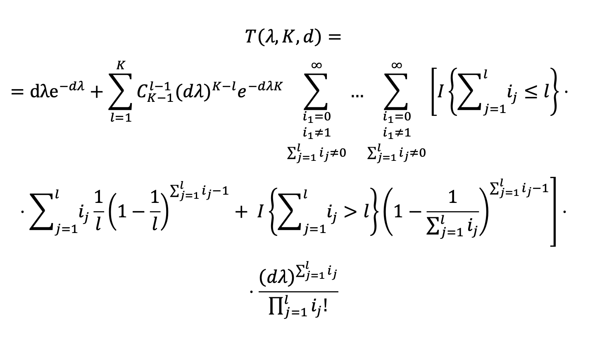

# Теоретическая формула для вычисления пропускной способности

Теоретическая формула для вычисления пропускной способности для произвольного 
числа каналов и длительности слота:

<p align="center">
    
</p>

, где
```
λ - интенсивность входного потока;
K - предполагаемое количество каналов (K >= 1);
d - длительность слота (обычно принимается за 1);
I{выражение} - индикаторная функция, принимающая следующие значения: 1 - истина, 0 - ложь
```

Для нормировки значения выходного потока в ед. вр. необходимо принять во 
внимание длительность слота *t*: 

<p align="center">
    
</p>


## Программная реализация

Формула для расчета пропускной способности приведена на 2-х ЯП: 
- Python (3.11.3) 
- Matlab (R2023b)

В обоих реализациях функция `calc_throughput()`:
- принимает на вход интенсивность вх. потока λ (float), длину слота t (float) и
 количество каналов K (int);
- возвращает значение пропускной способности T(λ) (float);
- использует рекурсию для вычисления сумм пользователей в каналах.

### Рекурсивная функция generate_users_in_channels()

Для подсчета комбинаций сумм пользователей, попавших в конфликт (G_c) в каналах
l = 1..K, используется рекурсивная функция `generate_users_in_channels()`.

#### 1. Сумма до бесконечности

В теор. формуле суммирование проходит до бесконечного числа пользователей, в 
программе верхняя граница макс. числа пользователей m = 10, погрешность 
расчетов остается минимальной.

#### 2. Пример работы функции

Функция генерирует m^l комбинаций прихода пользователей в каналах, где m - 
максимальное количество пользователей в канале (0..m-1), l - кол-во каналов.

Для кол-ва каналов l = 2 и пользователей m = 3 (0,1,2) результат будет 
следующим:

```
[0, 0]    [1, 0]    [2, 0]
[0, 1]    [1, 1]    [2, 1]
[0, 2]    [1, 2]    [2, 2]
```
, где комбинации [0, 0], [0, 1], [1, 0], [1, 1], [1, 2], [2, 1] - нерелевантны
(событие УСПЕХ хотя бы в 1 канале, или ПУСТО во всех каналах).

#### 3. Возможная оптимизация

Т.к. функция имеет экспоненциальный рост с ростом числа каналов, подсчет 
пропускной способности начиная с ~10 каналов занимает длительное время.
Возможные способы оптимизации:
- [ ] Кешировать промежуточные значения m^l (т.к. каждый следующий шаг 
перевычисляет это заново);
- [ ] Предвычислять размер массива комбинаций, не перевыделяя память append'ами;
- [x] Найти оптимальное значение для `INFINITY`;
- [x] Не вычислять и не хранить нерелевантные комбинации (для l=2:  [0,0], [0,1], 
[1,0], [1,1], [1,2], [2,1]).
