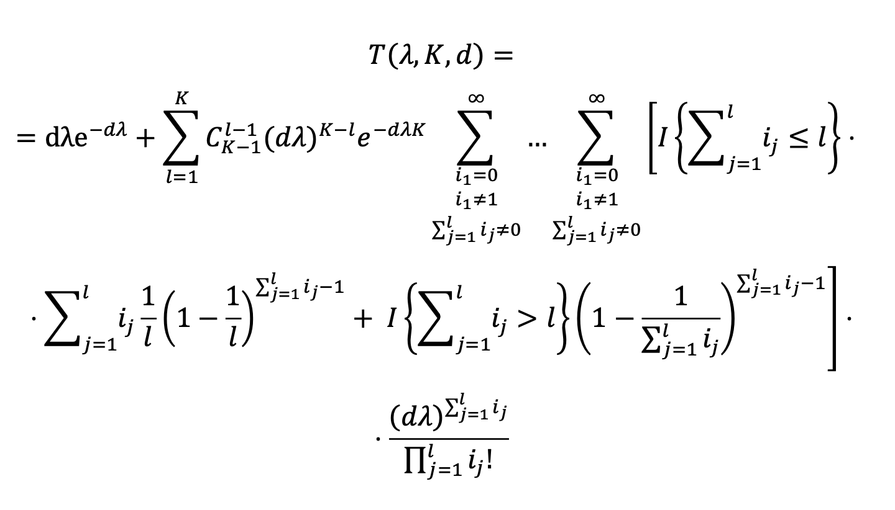
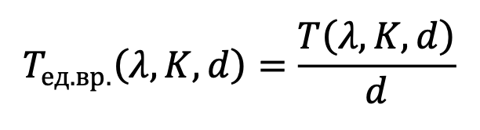

# Theoretical Throughput Formula

Theoretical formula for calculating throughput for an arbitrary number of
 channels and slots duration:

 <p align="center">
    
</p>

, where
```
λ - input arrival rate intensity;
K - number of channels (K >= 1);
d - slot duration (usually, equals to 1);
I{statement} - indicator function, taking the following values: 1 - true, 0 - false
```

To normalize output rate intensity value per time, it is needed to include
 duration of the slot *t* in the formula above: 

<p align="center">
    
</p>

## Implementaiton

The formula for calculating throughput is implemented in 2 languages:
- Python (3.11.3) 
- Matlab (R2023b)

In both implementations `calc_throughput()` function: 
- takes input arrival rate intensity λ (float), slot length t (float) and 
number of  channels K (int); 
- returns the throughput T(λ) (float); 
- uses recursion to calculate sums of users in channels.

### Recursive Function generate_users_in_channels()

To calculate combinations of sums of users in contention (G_c) in channels l =
1..K, the recursive function `generate_users_in_channels()` is used.

#### 1. Sum to Infinity

The summation goes to an infinite number of users in theoretical formula above.
In program upper limit of max number of users m can be = 10 with minimal 
calculations error.

#### 2. Example of How It Works

The function generates m^l combinations of users arrival per channels, where
 m - max amount of users in the channel (0..m-1), l - channels number.

E.g., for l = 2 and m = 3 (0,1,2) the result will be the following:

```
[0, 0]    [1, 0]    [2, 0]
[0, 1]    [1, 1]    [2, 1]
[0, 2]    [1, 2]    [2, 2]
```
, where combinations [0, 0], [0, 1], [1, 0], [1, 1], [1, 2], [2, 1] are 
irrelevant (SUCCESS event happened at least once per channel or EMPTY event 
occured all over the channels).

#### 3. Possible optimizations

So as function for calculating the throughtput has exponential increase factor,
the calculation of the throughtput beginnig with ~10 channels takes a lot of 
time. Possible optimization approaches are:
- [ ] Caching temporary results of m^l calculations (because every next step lists 
it again);
- [ ] Precalculating size of combinations array instead of using append's;
- [x] To find optimal value for `INFINITY`;
- [x] Not to calculate & store irrelevant combinations (for l=2: [0,0], [0,1], 
[1,0], [1,1], [1,2], [2,1]).
